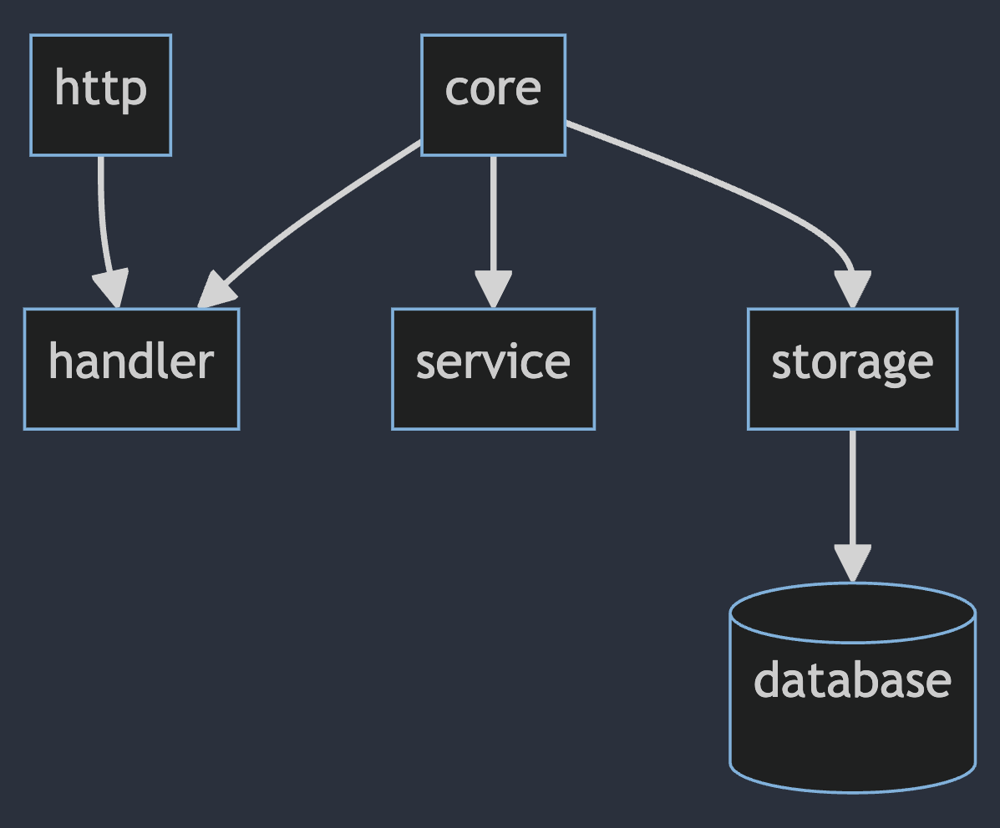

# SH Account

Account management server.

- Login
- Register
- Change Password
- Logout

handle session with jwt

## init

- `make init`

## Running the project

- `make run`
- `air`
- `go run main.go`

## Architecture

The application in primarily divided into 3 layers:

- Handler
- Service
- Storage

and a core package that contains the common code.

### Core

Contains the model and interfaces that are shared between the layers.

### Handler

Handler Handles the request and response here are the responsibilities of the handler:

- Parse the request data
- Validate the data
- Transform the data to core model
- Call the service layer
- Log internal errors
- Handle Authorization
- Send the response

### Service

Service is the business logic of the application. Here are the responsibilities of the service:

- Process the data
- Call the storage

### Storage

Storage is the layer that interacts with the database. Here are the responsibilities of the storage:

- Query the database
- Return the data